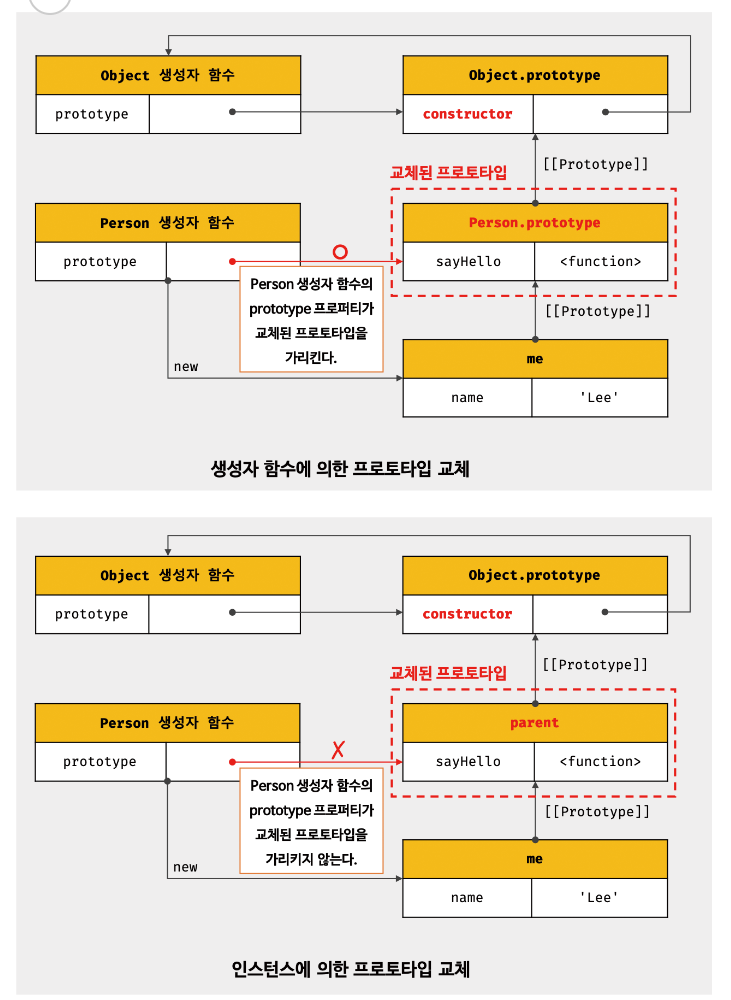

# 프로토타입
## 객체지향 프로그래밍
```javascript
// 이름과 주소 속성을 갖는 객체
const person  {
    name: 'Lee',
    address: 'Seoul'
};
```
- 객체: 상태 데이터와 동작을 하나의 논리적인 단위로 묶은 복합적인 자료구조

## 상속과 프로토타입
- 자바스크립트는 프로토타입을 기반으로 상속을 구현하여 불필요한 중복을 제거함. -> 기존의 코드를 적극적으로 재사용.

## 프로토타입 객체
### __proto__접근자 프로퍼티
- 모든 객체는 __proto__접근자 프로퍼티를 통해 자신의 프로토타입, 즉 [[prototype]] 내부 슬롯에 간접적으로 접근할 수 있다.

* * *
***__proto__ 접근자 프로퍼티는 상속을 통해 사용된다.***

```javascript
const person = { name: 'Lee' };

// person 객체는 __proto__ 프로퍼티를 소유하지 않는다.
console.log(person.hasOwnProperty('__proto___'));

// __proto__ 프로퍼티는 모든 객체의 프로토타입인 객체인 Object.prototype의 접근자 프로퍼티다.
console.log(Object,getOwnPropertyDescriptor(Object.prototype, '__proto__'));
// {get: f, ser: f, ennumerable: false, configurable: true}

//모든 객체는 Object.prototype의 접근자 프로퍼티 __proto__를 상속받아 사용할 수 있다.
console.log({}.__proto__ === Object.prototype); //true
```

### 함수 객체의 prototype 프로퍼티
- 함수 객체만이 소유하는 prototype 프로퍼티는 생성자 함수가 생성할 인스턴스의 프로토타입을 가리킨다.

## 리터럴 표기법에 의해 생성된 객체의 생성자 함수와 프로토타입
- 리터럴 표기법에 의해 생성된 객체도 가상적인 생성자 함수를 가짐. 
- 프로토타입과 생성자 함수는 단독으로 존재할 수 없고 언제나 쌍으로 존재.

## 프로토타입의 생성 시점
- 생성자 함수가 생성되는 시점에 더불어 생성

## 사용자 정의 생성자 함수와 프로토타입 생성 시점
- 생성자 함수로서 호출할 수 있는 함수, 즉 constructor는 함수 정의가 평가되어 함수 객체를 생성하는 시점에 프로토타입도 더불어 생성

## 빌트인 생성자 함수와 프로토 타입 생성 시점
- 객체가 생성되기 이전에 생성자 함수와 프로토타입은 이미 객체화되어 존재함.
- 이후 생성자 함수 또는 리터럴 표기법으로 객체를 생성하면 프로토타입은 생성된 객체의 [[Prototype]] 내부 슬롯에 할당됨.

## 객체 생성 방식과 프로토타입의 결정
1) 객체리터럴
2) Object 생성자 함수
3) 생성자 함수
4) Object.create 메서드
5) 클래스(ES6)

## 프로토타입 체인
자바스크립트는 객체의 프로퍼티(메서드 포함)에 접근하려고 할 때 해당 객체에 접근하려는 프로퍼티가 없다면 [[Prototype]] 내부 슬롯의 참조를 따라 자신의 부모 역할을 하는 프로토타입의 프로퍼티를 순차적으로 검색함. 이를 **프로토타입 체인**이라고 하며 이는 자바스크립트가 객체지향 프로그래밍의 상속을 구현하는 메커니즘임.

**스코프 체인**은 식별자 검색을 위한 메커니즘
- **스코프 체인**과 **프로토타입 체인**은 서로 연관없이 별도로 동작하는 것이 아니라 서로 협력하여 식별자와 프로퍼티를 검색하는 데 사용됨.

## 오버라이딩 프로퍼티 섀도잉
```javascript
const Person = (function () {
    // 생성자 함수
    function Person(name) {
        this.name = name;
    }

    // 프로토타입 메서드
    Person.prototype.sayHello = function () {
        console.log(`hi ! My Name is ${this.name}`);
    };

    // 생성자 함수를 반환
    return Person;
}());

const me = new Person('Lee');

// 인스턴스 메서드
me.sayHello = function () {
    console.log(`hi ! My Name is ${this.name}`); // 오버라이딩딩
};

// 인스턴스 메서드가 호출됨. 프로토타입 메서드는 인스턴스 메서드에 의해 가려짐
// 프로퍼티 섀도잉
me.sayHello();
```

## 프로토타입의 교체
### 생성자 함수, 인스턴스에 의한 프로토타입의 교체


## instanceof 연산자
- 우변의 생성자 함수의 prototype에 바인딩된 객체가 좌변의 객체의 프로토타입 체인 상에 존재하면 true로 평가되고, 그렇지 않은 경우에는 false로 평가됨.
```javascript
// 생성자 함수
function Person(name){
    this.name = name;
}

constme = new Person('Lee');

// 프로토타입으로 교체할 객체
const parent = {};

// 프로토타입의 교체
Object.setPrototypeOf(me, parent);

// Person.prototype이 me 객체의 프로토타입 체인 상에 존재하지 않기 때문에 false
console.log(me instanceof Person);
// Person.prototype이 me 객체의 프로토타입 체인 상에 존재하기 때문에 true
console.log(me instanceof Object);
```

## 프로퍼티 존재 확인
### in 연산자

```javascript
const person = {
    name: 'Lee'
};
// 존재함
console.log('name' in person); // true
// 존재하지 않음음
console.log('age' in person); // false
```
## 프로퍼티 열겨
### for...in 문
```javascript
const person = {
    name: 'Lee',
    address: 'Seoul'
};

// for...in 문의 변수 pprop에 person 객체의 프로퍼티 키가 할당됨됨
for (const key in person) {
    console.log(key + ':' + person[key]);
}
```
