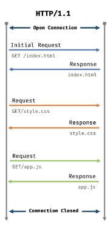
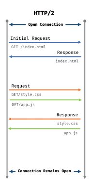

# 브라우저의 렌더링 과정

## 요청과 응답

 브라우저의 핵심 기능은 필요한 리소스를 서버에 요청하고 서버로부터 응답받아 브라우저에 시각적으로 렌더링하는 것임. 즉, 렌더링에 필요한 리소스는 모두 서버에 존재하므로 필요한 리소스를 서버에 요청하고 서버가 응답한 리소스를 파싱하여 렌더링하는 것임.

 서버에 요청을 전송하기 위해서는 브라우저는 주소창을 제공. 브라우저의 주소창에 URL을 입력하고 엔터를 누르면 URL의 호스트 이름이 DNS를 통해 IP주소로 변환되고 이 IP 주소를 갖는 서버에게 요청을 전송.

 ## HTTP 1.1과 HTTP 2.0

 - 웹에서 브라우저와 서버가 통신하기 위한 프로토콜.

 HTTP 1.1은 기본적으로 커넥션당 하나의 요청과 응답만 처리.
 

 HTTP 2.0는 다중 요청/응답 가능.
 

 
## HTML 파싱과 DOM 생성

 브라우저의 요청에 의해 서버가 응답한 HTML 문서는 문자열로 이루어진 순수한 텍스트.

 순수한 텍스트인 HTML 문서를 브라우저에 시각적인 픽셀로 렌더링하면 HTML 문서를 브라우저가 이해할 수 있는 자료구조로 변환하여 메모리에 저장해야 함.

## CSS 파싱과 CSSOM 생성

  렌더링 엔진은 DOM을 생성해 나가다가 CSS를 로드하는 link 태그나 style 태그를 만나면 DOM 생성을 일시 중단함.
  그리고 link태그의 href어트리뷰트에 지정된 CSS파일을 서버에 요청하여 로드한 CSS 파일이나 style 태그 내의 CSS를 HTML과 동일한 파싱 과정을 거치며 해석하여 CSSOM을 생성.
  이후 CSS 파싱을 완료하면 HTML 파싱이 중단된 지점부터 다시 HTML을 파싱하기 시작하여 DOM 생성을 재개.

  
## 렌더 트리 생성

 렌더링 엔진은 서버로부터 응답된 HTML과 CSS를 파싱하여 각각 DOM과 CSSOM을 생성하고 DOM과 CSSOM은 렌더링을 위해 렌더 트리로 결합.

 렌더 트리는 렌더링을 위한 트리 구조의 자료구조.
 브라우저 화면에 렌더링되지 않는 노드와 되는 노드들은 포함하지 않음.

 