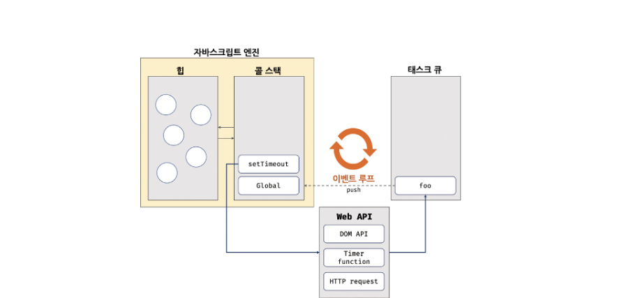

# 비동기 프로그래밍

## 동기 처리와 비동기 처리

자바스크립트 엔진은 한번에 하나의 태스크만 실행할 수 있는 싱글스레드 방식으로 동작함.

싱글 스레드 방식은 처리에 시간이 걸리는 테스크를 실행하는 경우 블로킹이 발생.

*** 
동기 처리 : 현재 실행중인 태스크가 종료할 때까지 다음에 실행될 태스크가 대기하는 방식.
동기처리 방식은 태스크를 순서대로 하나씩 처리하므로 실행 순서가 보장된다는 장점이 있지만, 태스크가 종료할 때까지 이후 태스크들이 블로킹되는 단점이 있음

비동기 처리: 현재 실행중인 태스크가 종료되지 않은 상태라 해도 다음 태스크를 곧바로 실행하는 방식.
타임함수인 setTimout과 setInterval, HTTP요청, 이벤트 핸들러는 비동기 처리 방식으로 동작

## 이벤트 루프와 태스크 큐

- 이벤트 루프

콜 스택과 힙으로 구성되어 있는 자바스크립트 엔진은 단순히 태스크가 요청되면 콜 스택을 통해 요청된 작업을 순차적으로 실행할 뿐임.

비동기 처리에서 소스코드의 평가와 실행을 제외한 모든 처리는 자바스크립트 엔진을 구동하는 환경인 브라우저 또는 Node.js가 담당함.

비동기 함수인 setTimeout 의 콜백함수는 태스크 큐에 푸시되어 대기하다가 콜 스택이 비게 되면, 비로소 콜 스택에 푸시되어 실행됨.

자바스크립트는 싱글 스레드 방식으로 동작. 이때 싱글 스레드 방식으로 동작하는 것은 브라우저가 아니라 브라우저에 내장된 자바스크립트 엔진이라는 것에 주의. 만약 모든 자바스크립트 코드가 자바스크립트 엔진에서 싱글 스레드 방식으로 동작한다면 자바스크립트는 비동기로 동작할 수 없음.
